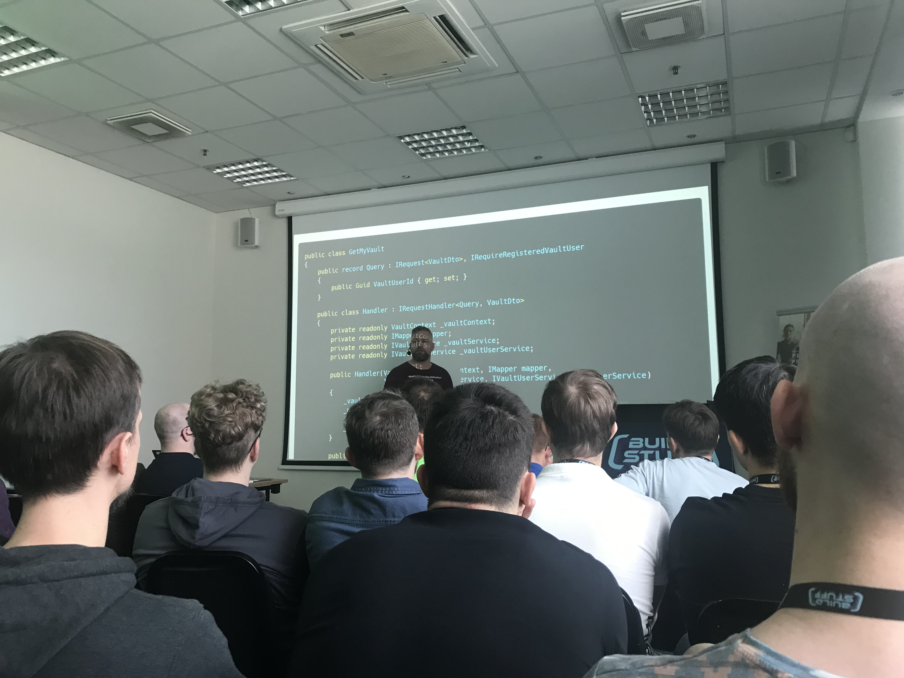

# Building that glorious monolith

Glenn F. Henriksen - CTO & Co-founder @ Justify

How to avoid micro services ?

On paper, micro-services advantages looks great. It’s shinny.

But there are drawbacks - we often forget.

Complexity grow exponentially along size.
One big problem w/ monolith is to manage this complexity.
We need to introduce dampening mecanisms.

Anecdote : it's like when you take salt at the opposite of the table, rather than asking for someone to give it to you.

Complexity often come from blurry borders.

Solution: Box it!
- Domain: aggregates…, domain services, …)
- App layer
- Boundary of the box: Dto = limited coupling surface

Simple model: Thing Dto, Thing service, thing.
Problem is that service grow quickly as use cases arrives !
Split it

Notes:
- usage of mapper object
- One file by use case
- Nested classes (DeleteUser contains DeleteUserDto, DeleteUserHandler, ...)
- Frontier as public api

## Apply discipline of micro without doing it

One context per feature.
One Schema per feature.

Ok, how to sync everyone ? Events

In his framework, entities hold domain events (it's part of the base class)
``` 
abstract class Entity 
{
    private List<DomainEvent> _events;
    public void AddEvent(DomainEvent event) => _events.Add(_event);
}
```


Nothing Prevent you reaching your domain, taking the salt. How to ensure this discipline ?
- trust your developers : pair code review, mob…
- create separate project (can quickly become messy. Alternative = devcop to achieve this on namespace)

Why this complexity ?
- well, it's not that not that complex
- we don't just want something that work, but also something that can grow with us
- works on projects of reasonable size

Starting w/ microservices is like downloading a new game and playing it in hard mode on the first party.

Start with the easy mode and get used to it, and later, move on!

At a certain time, monolith badly scale with your organisation. 
Extract things only when you have to.

## Q/A

You create one context per UseCase, what about performances ?
- Eventual consistency
- Denormalisation
- Few writes

# My questions:

About the mappers:
- Who's responsability is it to map dto2domain, domain2viewModel, domain2table-model, table-model2domain, ...
- I see you inject mapper in you handler, is it a global mapper or one dedicated to repository
- Does each "component" like Handler, Repository, ... have their own mappers ?

About the DBs and events:
- How domain events reach other BCs ?
- When are they published at the app level ?
- Do you use orchestration or choreography ?


- His their somewhere we I can find your slides ?


- 