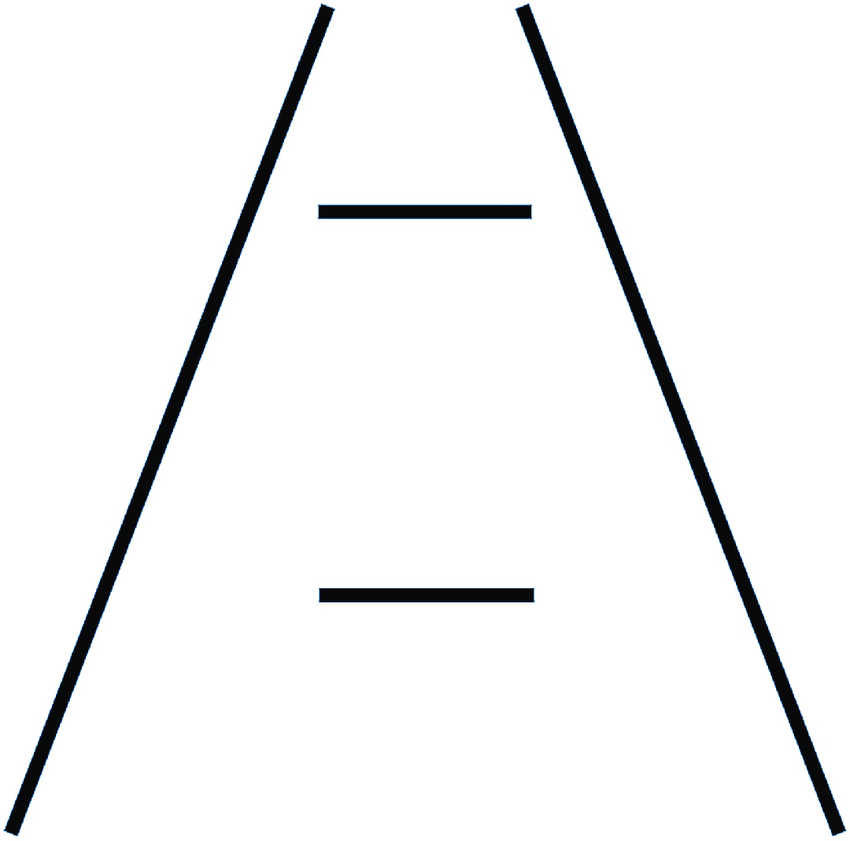
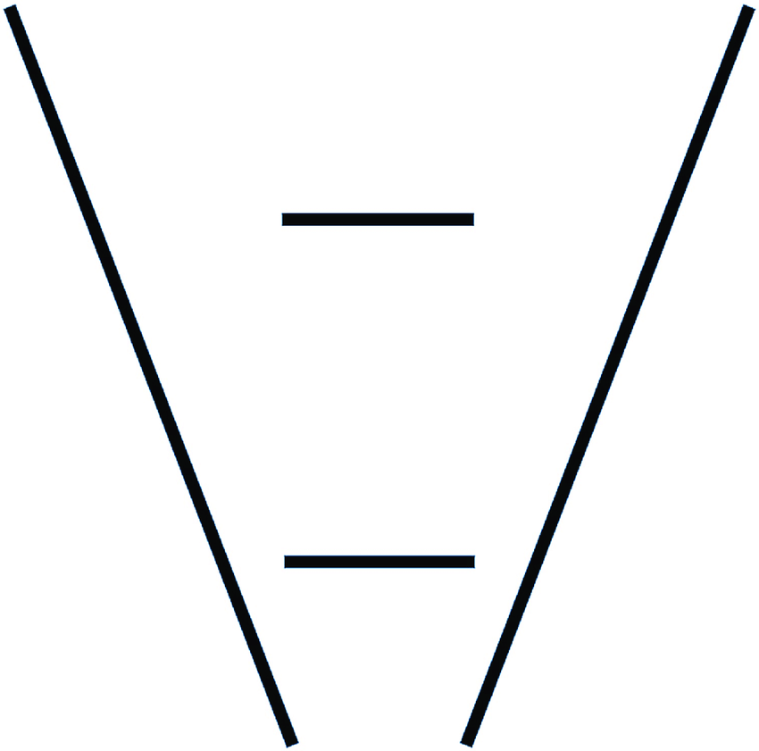
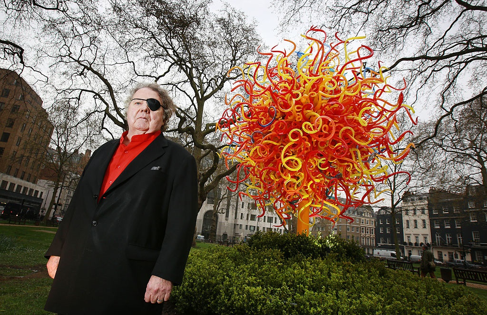
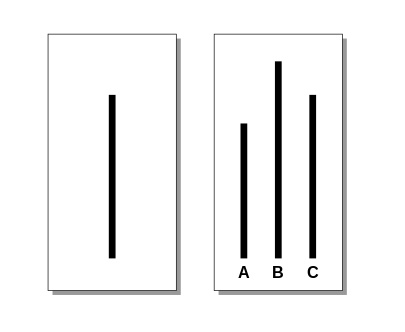

# Iconoclasm

Back in the old days, formula was quite simple: study at university, find a job, ...

Today, things are not that obvious. 

China and india produce lot of engineers and everyone is worrying about outsourcing, but it's the wrong thing to worry.

Kasparov, great chess champion, defeated by Deep blue. And developers start feeling this pinch.

What to do in such situation ? Do things people are not good at. Become iconoclast.

- see things differently
- overcome fear
- use social intelligence

## Perception is matter of brain, not the eyes

Ponzo illusion

    
    

The way we perceive things will be consistent with what we have seen before. In this diagram, our brain guess there is some perspective in the game and interpret one bar larger than the other one.

Something very curious is that if you flip the image, illusion disappear. We are not used to such perspectives.

Dale Chihuly become very successful after he lost an eye. He was no more able to do symmetric stuff

## Don’t be driven by fear

The Dixie Chicks: 
- The publicly criticized Bush and invasion of Iraq during a concert in London
- Followed a lot of pressure (death threats, ...) 
- But they never recanted. 
- Their next album was refused by radio stations.
- But they hit to charts anyway!

Ellsberg paradox: an evidence of ambiguity aversion, in which a person tends to prefer choices with quantifiable risks over those with unknown, incalculable risks.

We are wired to follow others. In the wild, that’s how you don’t get eaten by tiger.

## Use social intelligence

Challenger Accident: 
- organization failed to recognize a problem. 
- then failed to fix it
- finally considered it as acceptable risk.

Solomon Asch conformity experiment: 
- 12 people are asked to say aloud which line match the length of the first line 
- The focus is put on the response of the last one
- **if before, everyone said A, even if it's obviously false, people convince themselves to go with the crowd and say A**.
- one C is enough to open door to B. **One people doing a step aside is enough to make the last one feel he can answer something else**

It’s something that happens in planning poker.

You could never bring dark net on top of iPhone ...
You could never create an efficient GC ...
...

> **Even if you are right.**
>
> **If you cannot exercise social intelligence**
> 
> **Not able to deliver your message**

You are not going to get any traction

It's like Picasso vs Van Gogh, or Edwin Howard Armstrong that ended up commit suicide.

# Conclusion

An iconoclast is:
- someone who see things differently
- someone who overcome fear
- someone who use social intelligence (familiarity + reputation, approachable, …) to influence

# Takeaway
- Perception is matter of brain, not the eyes
- Don't be driven by fear
