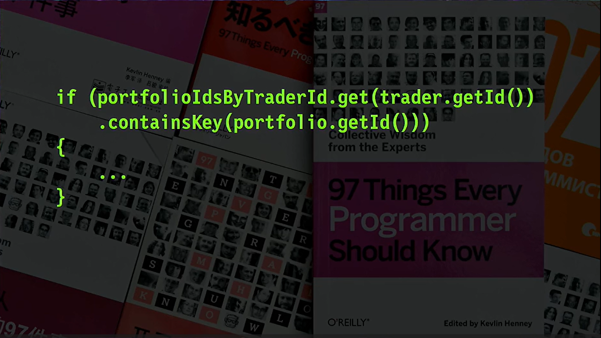
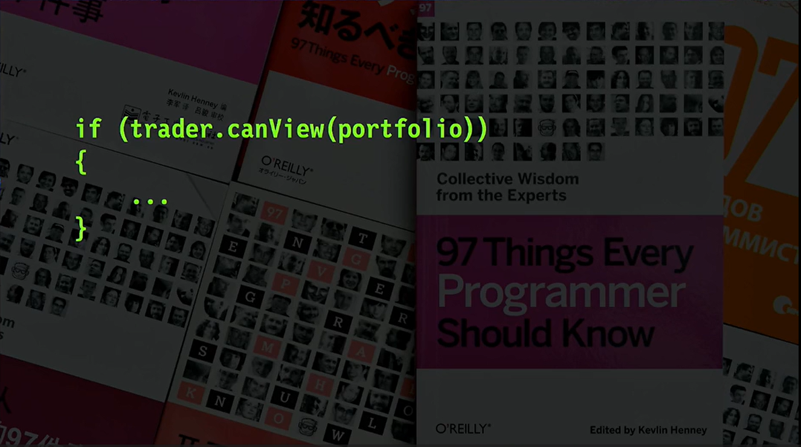
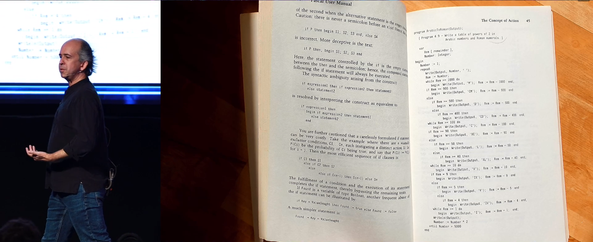
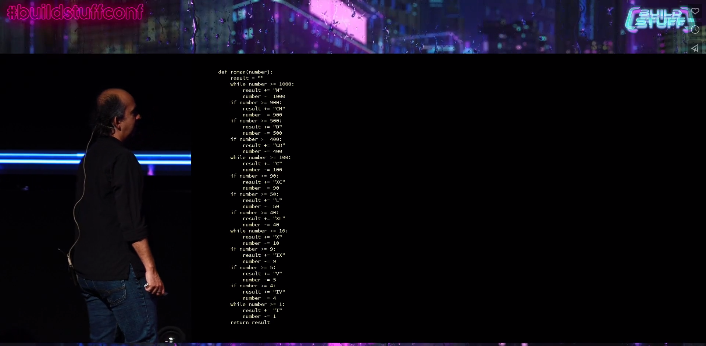

# Refactoring is not just clickbait

by Kevlin Henney

Stonehenge stone circle = Typical legacy system. We don’t no why they built it

Among the more common misinterpretations of what refactoring is:
- reducing refactoring to renaming of variable
- associate refactoring something that take a lot of time, months

**Refactoring is a design practice**

> Developers are drawn to complexity like moths to a flame, often with the same outcome -- Neal Ford

Technical debt is not a problem. Unmanaged technical debt is one. 

But technical debt is an outcome. But what people experience is technical neglect (cause).
So much to do, so much to know, you cannot pay attention to everything.
Software development is a process of knowledge acquisition.

Is this codebase habitable ?

We can refactor for several purpose:
- for comprehension
- for performance
- to prepare add of a new feature

Rough 3-dimensional piece of code qualities model:
- functional (behavior)
- operational (time and space)
- developmental (maintainability)

| How this impact | Functional | Operational | Developmental |
|-----------------|------------|-------------|---------------|
| Feature adding  | +          | +/-         | +/-           |
| Optimization    | =          | +           | +/-           |
| Refactoring     | =          | +/-         | +             |

One intent per commit.

**The way we spend our days is, of course, the way we spend our lives.**

Dan North one : code in the language of the domain.

    
    

Many refactoring are about adding intention to the code.

## The case of public apis

You cannot refactor everything - especially public apis! 

Public apis are like diamond: Forever.

> **Don’t publish interfaces prematurely.**

See cloneable
- https://bugs.java.com/bugdatabase/view_bug.do?bug_id=1234712
- https://en.wiktionary.org/wiki/clonable#English

Open/Close principle is terrible
- don't do that
- make code as open to modification as possible 
- resist temptation to make it extensible

## Popular refactorings

We do a terrible usage of "Extract Class"
- MachinManager, …
- it just put the mess somewhere else
- Keep it in a fucking method !!

Some refactorings are underestimated
- Inline: to regroup things
- Replace control with pipeline
- Replace switch with polymorphism
- Delete: One common mistake is that we tend to think additively.

## It's not a flow problem, but a data structure one

Pascal was reputed good language, with good design, good practice. But example you can find in such books are terrible!

> `if` is a special case of `while`

> **Sometime, it’s not a problem of flow but of data structure.**

C# example. Why **doing** something when you can **be** something?

## Conclusion

> **There is no work like early work. Clear as you go. Muddle makes more muddle. Not to wash plates and dishes soon after using makes more work** -- Isabella Beeton, on Household management

> The only kind of writing is rewriting -- Hemingway

# My takeaway

- I liked the few examples he gives (about public apis with cloneable, about terrible code with pascal examples, about replace with if/while, about data structures w/ the C# one)
- often it's not a flow problem, but a problem of data structure
- refactoring has undeterministic outcomes, extract method can produce both positive and negative outcomes. It's important to experiment, take time to watch the code, and be able to rollback.
- practice refactoring through code katas

Resources:
- 97 things developer should know
- https://thevaluable.dev/open-closed-principle-revisited/

Ideas: 
- Présenter refactoring du kata numeral en live coding