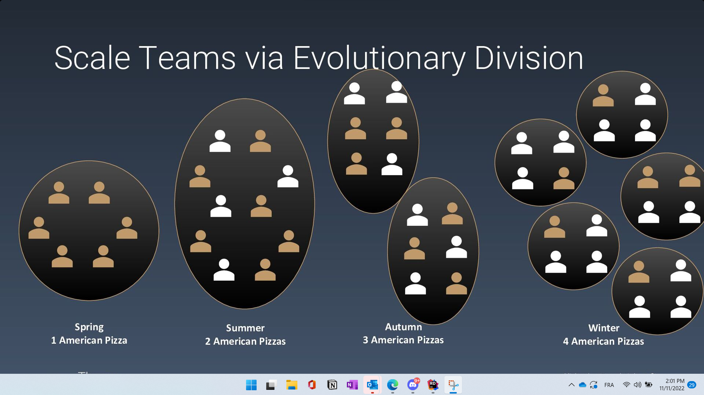

# Remote scaled trunk based development

by Richard Gross  -- Teenager developer

## Why big software fails ?

According to chaos report: size is the single most important factor in the outcome.
But, this is a controversial report (due to the metrics used: on time and on budget)

Experts opinions : failure because of politics
Because they are big ?

Interesting part : think big, act small

## What to do if you have to do a big project ?

What do to when you client come and says « I need 4 teams », and it's non negotiable.

**Scale software via evolutionary design!**

Guitar analogy:
- Start simple, iterate and improve it
- You may reach a point where most users are satisfied.
- Be careful with the complex guitar : you may loose users !

Scale team the same way. Team implies conflicts. The more people, the more frictions. Fresh team have :
- a lot of beef: architecture pattern, I don't like how you write your tests, Clean code is ...
- a lot to discover (especially when people comes from different background)
- a lot to agree.

Some remarks: 
- grow before you split.
- don't start immediately with 4 teams, add your ingredients quickly ok, but progressively.

## Experimentation

Try/do : colocated team

### Try: a process to improve

Dev Talk :
- 1H weekly
- present, discuss, agree on tech
- result often in ADR that put on paper the context and the decision
- things can change because context changed

1 day of slack time per week on monday.

Experiment.

Retro : what to keep, try, remove

Slack time:
- can help having business focus backlog
- try to explicit slack time

### Try: trunk based development.

Nicest and simplest branching strategy

Avoid long lived branch, continuous isolation.

Small focused commit. Easier to review !

If you deploy, break something and cannot fix it within 10 minutes, revert.

### Try: start with a monolith

- At project inception, you have the less knowledge.
- Refactoring on a monolith as tool support

### Try: everything in one repo

One repo with everything team need: 
- all services
- all shared libraries
- all documentation
- all onboarding shell scripts

Align teams by
- dev talks and adr
- coffee machine
- re-teaming

Dynamic stream:
- is good for knowledge management
- but it's too beef when there is many peoples.

"What’s next" meeting for each stream.

### Try daily retros

20 min at the end of the day, by stream.

Pros : 
- problems encountered are still fresh
- you reflect and connect with others

Team or stream long retro: on demand.

### Try a response team

Goal is to minimize context switching, respond to bug, keep environment stable.

### Try: create virtual rooms so it's easy to find people when they are available

# Takeaway

- experiment
- do things progressively

# Q/A

- How do you involve people in dev talk ?

# Resources:
- [slides](https://speakerdeck.com/richargh/remote-scaled-trunk-based-development)