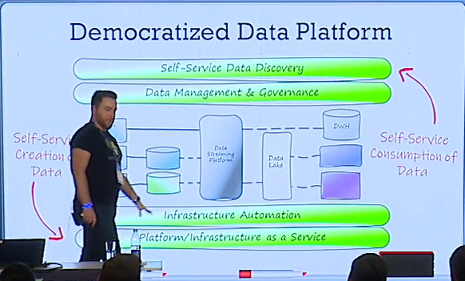

# Tales of data architecture
—

> BigData in your job title = 💰

Data architecture is an evolutionary process.

Still an important factor when we work with data: 
- it's hard to go back!
- moving data from one to another format is painful

## Day 1 : monolith. 1 Service , 1 RDBMS (relational database management system)

At the beginning things are easy.
But things get complex when you start asking compute expensive questions. 
Performing analytic on top of a production DB is a really bad idea.

## Day 2 : the data warehouse, script that copy data into a dwh

Then, microservices comes:
- 1db per service
- the ETL batch become your full-time job!
- the DWH is only place where everything is gathered

Pb : 
- production data is a moving target with explosion of NoSQL techs (relational, blobs, json, ...)
- your ETL is a bottleneck and cannot stand the scale

## Paradigm shifts #1
- shape: relational data -> non relational data
- scale: millions of records -> billions of records
- actors: data consumer of pre-aggregated data -> data professionals

## The data lake :
- ETL with airflow (still sucks)
- simple infinite collection of blobs linked to a DWH

## Paradigm shift #2 (a painful one)
- latency: daily/hour latency -> real time
- scale: billions of records -> 100s of billions of records
- 10s of data sources -> 100s of data source

Once you now you will need it, start early !

Polyglot : +/- persist your data in different formats

## Paradigm shift #3
- professionals -> everyone
- 10s of data professionals -> 100s of data professionals
- 100s of data products -> 1000s of data products
- merging the operational plane and analytical plane
- data engineering -> data infrastructure

Usually for really big companies

Once you have thousands of tables, how to know where to find it? It open the wild world of data governance, …

## Data-mesh : add decentralization

## Conclusion 

- Simple is better ?
- Do we really need this ?

Presented architecture is a sustainable one - but complex. Answer is up to you and your business, your context, your scale.
If you are going to build your data architecture, think about what is your next step.