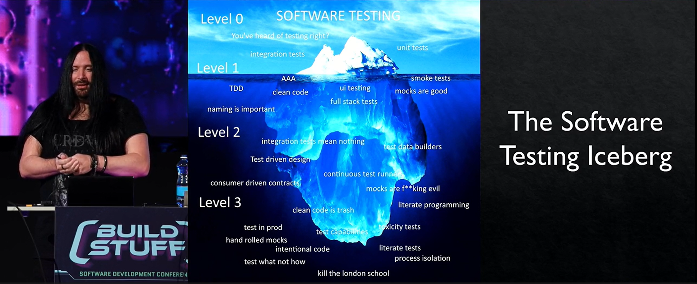
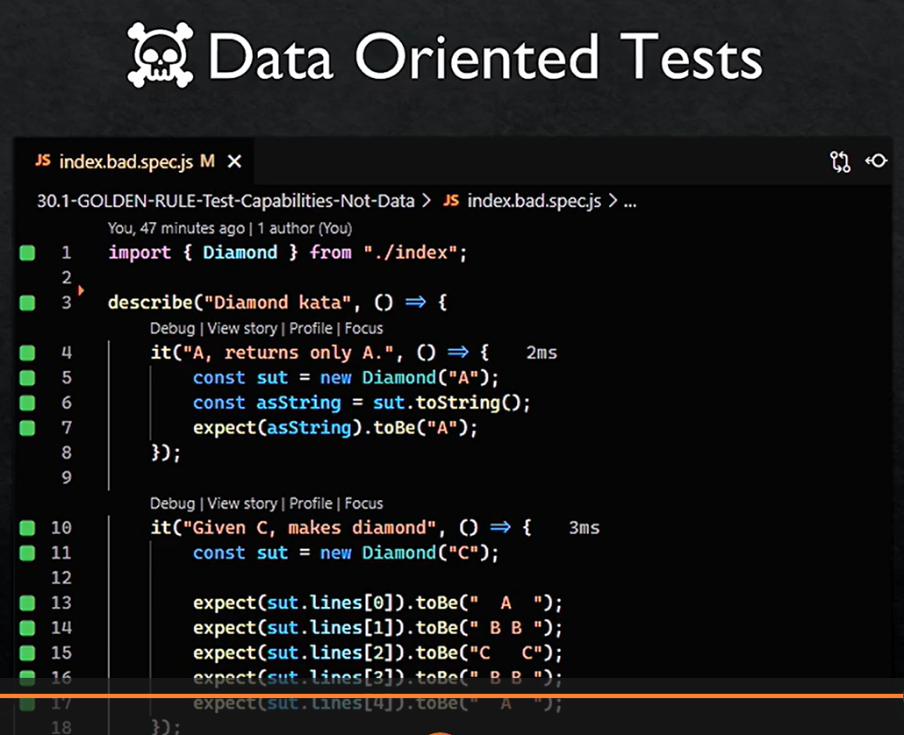
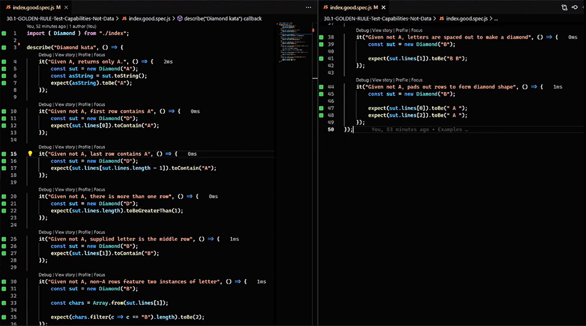

# Writing tests that don’t suck

by David Whitney

How to write tests that survive?

Why do we tests ?
- Testing is a software discipline
- the way to prove something work

> The framework wars: Once you start talking about something, everyone start asking which lib/framework to use, long debates, …

Assertion lib = syntactic sugar

Traditional pyramid of test : too simplistic

There is a constellation of tests

How to name a test ?
- What you are invoking,
- under which conditions, 
- and what your expectations are

> There is debates about class in js that are not. We don’t care. Just organize your code in a comprehensive fashion.

TDD?
- Of course! How else could you program?
- Test Driven Design !

> Continuous test runner is a great tool.

You can use Wallaby.js in js/typescript.

Writing with intention:
- Clean Code reduce conversation about quality, design and architecture
- Burn clean code
- Read TDD by example

Intentional > clean
- Rhythm matter
- Space matter
- Form matter

Recommendations:
- use AAA pattern
- Use white lines to separate arrange, act, assert
- No magic number - it doesn't convey your intention. You should optimize things for the reader. When we read, everything depends on the context.
- Hides unnecessary data (*). Include ONLY the data that impact the test
- Don’t repeat test data, use some builders
- Update your tests with last language features so it doesn't looks deprecated
- Use test data builders
- Isolate systems you don’t control with mocks
- There can be several assertions, but assert single concepts

Two golden rules of intention
- test the outcomes (what, not how ☠️)
- test capabilities rather than data

    
    

To go further:
- contract testing
- consumer driven contract

# My takeaways

- don't use magic variables in the tests
- try the diamond kata the way he suggest
